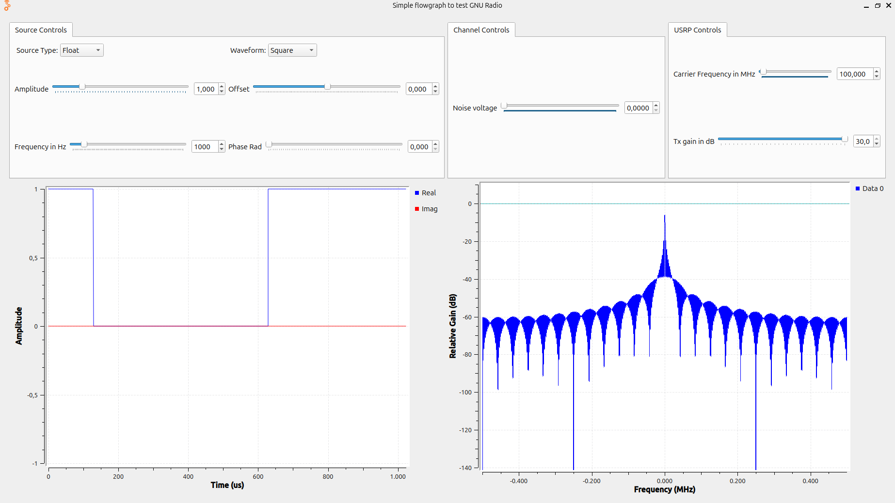

# Laboratorio de Comunicaciones
## Universidad Industrial de Santander

---

### **Integrantes**
- **Juan Carlos Cuadros Rodríguez** - 2194240  
- **Samuel Andres Leal Puentes** - 2191643

Escuela de Ingenierías Eléctrica, Electrónica y de Telecomunicaciones  
Universidad Industrial de Santander  

### **Fecha**  
O5 DE MARZO DE 2025  

---

## **Declaración de Originalidad y Responsabilidad**  
Los autores de este informe certifican que el contenido aquí presentado es original y ha sido elaborado de manera independiente. Se han utilizado fuentes externas únicamente como referencia y han sido debidamente citadas.  

Asimismo, los autores asumen plena responsabilidad por la información contenida en este documento.  

**Uso de IA**: Se utilizó Deepseek para reformular secciones del texto y verificar gramática, pero el contenido técnico fue desarrollado íntegramente por los autores.  

---

## **Contenido**

### **Resumen**  
Esta práctica, se enfocó en el aprendizaje y uso correcto de los equipos presentes en el laboratorio,se realizaron mediciones de potencia y frecuencia utilizando el software GNURADIO, junto con el analizador de espectros R&S FPC1000. Se logró medir el piso de ruido y el espectro de señales transmitidas con el USRP 2920. Se realizo un análisis de los espectros teninedo en cuenta parámetros tales como el ancho de banda y la relación señal a ruido (SNR), obteniendo resultados que permitieron comprender el comportamiento de las señales en el dominio de la frecuencia, aunque no se logró implementar el osciloscoopio en el análisis de los espectros.

**Palabras clave**: Potencia, frecuencia, piso de ruido, SNR (SIGNAL NOISE RATIO), GNU Radio.  

---

### **Introducción**  
En esta práctica, se utilizaron herramientas de software definido por radio (SDR) como GNU Radio, junto con equipos como el USRP 2920 y el analizador de espectros R&S FPC1000, para medir y analizar parámetros clave en comunicaciones, como potencia, ancho de banda, relación señal a ruido (SNR) y piso de ruido. El USRP 2920 opera en un rango de 50 MHz a 2.2 GHz, mientras que el analizador de espectros R&S FPC1000 cubre de 9 kHz a 1 GHz, lo que permite trabajar con señales de diferentes frecuencias. Para transmitir una señal en una frecuencia específica, se configuraron parámetros como la frecuencia de portadora, la ganancia de transmisión (Tx gain) y la frecuencia de muestreo (samp_rate).

El piso de ruido se midió observando una banda de frecuencias sin señal transmitida, donde parámetros como la frecuencia central, el SPAN y el RBW (Resolución de Ancho de Banda) influyeron en la precisión de la medición. En el dominio del tiempo, se analizó la forma de onda de la señal, mientras que en el dominio de la frecuencia, se estudió su contenido espectral. Aunque no se utilizó el osciloscopio, las mediciones con el analizador de espectros permitieron comprender el comportamiento de las señales en el dominio de la frecuencia, enfocándose en la potencia, el ancho de banda y el piso de ruido. 

---

### **Procedimiento**  
#### **Actividad 1: Revisión de Especificaciones de los Equipos**
Comenzamos revisando las especificaciones técnicas de los equipos utilizados en la práctica: el USRP 2920, el osciloscopio R&S RTB2004 y el analizador de espectros R&S FPC1000. A través de los manuales, identificamos las funciones principales y los controles de cada dispositivo. Seleccionamos las cinco especificaciones más relevantes de cada equipo, como el rango de frecuencia, la ganancia configurable y la resolución.

Para configurar el USRP 2920, conectamos la alimentación y el cable de red al dispositivo. Luego, desde un terminal, ejecutamos el comando uhd_usrp_probe para identificar el rango de frecuencia y la ganancia configurable. En el caso del analizador de espectros, configuramos el rango de frecuencia, la resolución y la figura de ruido para realizar mediciones precisas.

#### **Actividad 2: Simulación de Señales en GNU Radio**
Iniciamos GNU Radio y cargamos el flujograma otorgado por el docente. Identificamos los bloques principales, como Signal Source, Throttle, QT GUI Time Sink y QT GUI Frequency Sink, y configuramos la frecuencia de muestreo (samp_rate) en 20 kHz.

Al ejecutar el flujograma, observamos las señales generadas en las ventanas Time Sink y Frequency Sink. Modificamos parámetros como el tipo de dato de la fuente (compleja o flotante), la forma de onda, la frecuencia, la fase y la amplitud de la señal, posteriormente realizamos un analisis de cómo estos cambios afectaban el comportamiento de la señal en ambos dominios. También ajustamos el nivel de ruido en el modelo de canal para estudiar su impacto en la señal.

#### **Actividad 3: Transmisión y Medición de Señales con el USRP 2920**
Configuramos el USRP 2920 para transmitir señales a través de GNU Radio. Habilitamos y deshabilitamos los bloques que se especificaban en la guía, y ajustamos la frecuencia de muestreo (samp_rate) a 1 MHz. También modificamos la frecuencia y la ganancia del USRP para observar su efecto en la señal transmitida.

Conectamos la salida del USRP al analizador de espectros y medimos el piso de ruido normalizado a la frecuencia de portadora. Comparamos el espectro de la señal observado en el analizador con el obtenido en la simulación. Además, medimos la potencia de la señal transmitida y el ancho de banda de diferentes señales generadas.

Finalmente, conectamos una antena al analizador de espectros y observamos el espectro de una señal FM, midiendo su ancho de banda y relación señal a ruido (SNR).
---

### **Resultados**  
#### **Mediciones con el Analizador de Espectros**  
- **Piso de Ruido**: Se midió el piso de ruido normalizado a la frecuencia de portadora. En las imágenes adjuntas, se observa el espectro de la señal en 100 MHz con un span de 1 MHz.  
- **Espectro de la Señal**: Se observó el espectro de una señal FM entre 88 MHz y 108 MHz, midiendo su ancho de banda y relación señal a ruido.  

#### **Capturas de Pantalla**
1. **Noise Floor**:
   
   -**Imagen 1**: Espectro del ruido, se observa el piso de ruido luego de ajustar parámetros.
2. **Señal Square GNU Radio**:
     
   - **Imagen 2**: Simulacion de la señal de onda cuadrada.
3. **Espectro de la Señal Square en 100 MHz**:  
     
   - **Imagen 3**: Espectro de la señal cuadrada con un span de 1 MHz, donde se observa la señal centrada en 100 MHz.  

4. **Simulacion Señal Coseno**:  
     
   - **Imagen 4**: Configuración del flujograma en GNU Radio, donde se observa la generación de una señal senoidal con una frecuencia de 100 MHz y una ganancia de 50 dB.

5. **Espectro Señal Coseno**:  
     
   - **Imagen 5**: Espectro de la señal Coseno.

---

### **Conclusiones**  
1. El piso de ruido es un parámetro crític en las comunicaciones, ya que afecta la capacidad de detectar señales débiles. En este laboratorio, se logró medir un piso de ruido bajo, lo que permitió una buena calidad en la recepción de la señal.  
2. Se logró configurar correctamente el USRP 2920 para transmitir señales en una frecuencia específica, lo que permitió realizar mediciones precisas en el analizador de espectros.
3. Se logro familiarizarse con el uso del espectrometro obteniendo los espectros esperados por la guia.
4. Debido a la falta de uso del osciloscopio, no se pudo realizar un análisis completo en el dominio del tiempo. Sin embargo, las mediciones en el dominio de la frecuencia fueron suficientes para entender el comportamiento de la señal.  

---

### **Referencias**  
- Manual del USRP 2920.  
- Manual del Analizador de Espectros R&S FPC1000.  
- Documentación de GNU Radio.  

---

### **Anexos**  
En la carpeta se encuentran todas las capturas tomadas durante el proceso de la practica. 

---

Volver al [INICIO](#GNURADIO_LABCOMUIS_2025_1_E1B_G4)
